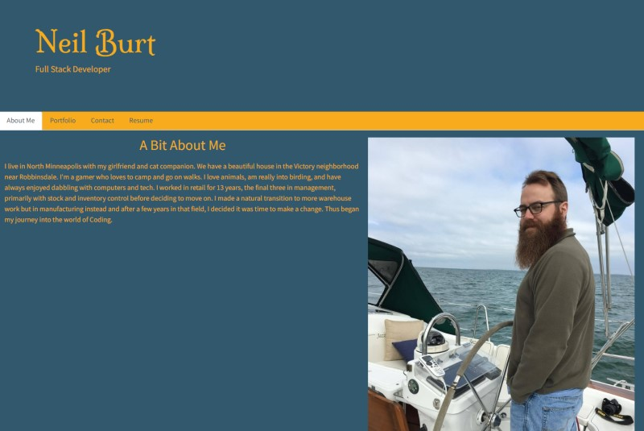
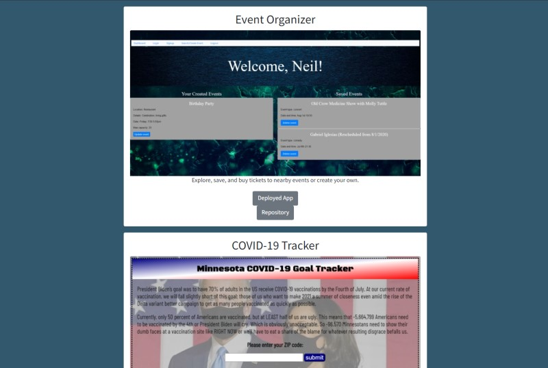
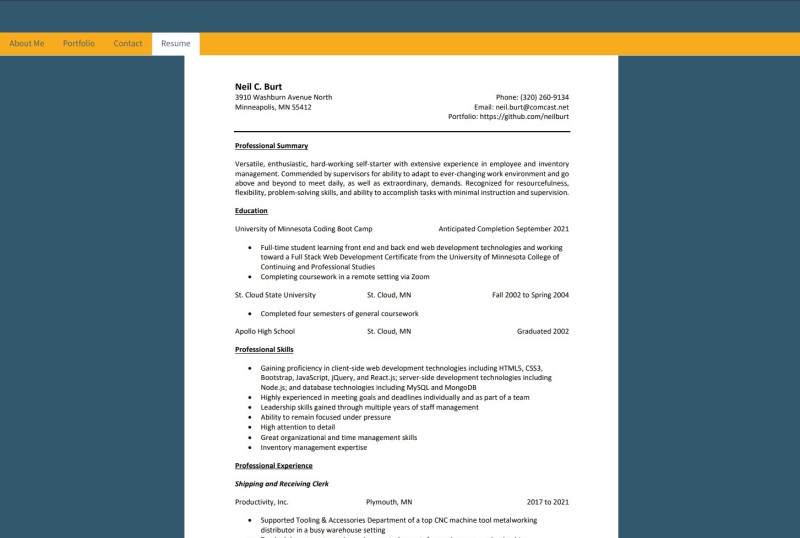

# React Portfolio  
  
## Description  
  
This is a single-page React-built portfolio detailing my professional offerings.  
  
## Table of Contents  
- ### [Installation](#installation)
- ### [Technology Stack](#technology-stack)
- ### [Usage](#usage)
- ### [Screenshots](#screenshots)
- ### [Contributing](#contributing)
- ### [Questions](#questions)
  
## Installation  
  
Just visit the link in the [Usage](#usage) section below and sidestep installation altogether!  

## Technology Stack  
  
JavaScript, HTML5, CSS3, React, and NodeJS.
  
## Usage  
  
A prospective employer or client can take a look at what I've got to offer them across the multiple sections of my page.  
  
Check out the [deployed app](https://stormy-crag-19904.herokuapp.com/).  
  
## Screenshots  
  
  
---  
  
  
  
---  
  
  
  
## Contributing  
  
Neil Burt  
  
## Questions  
  
If you have any additional questions:  
  
Visit my [GitHub profile](https://github.com/neilburt).  
  
Or you can [email me](mailto:neil.burt@comcast.net).